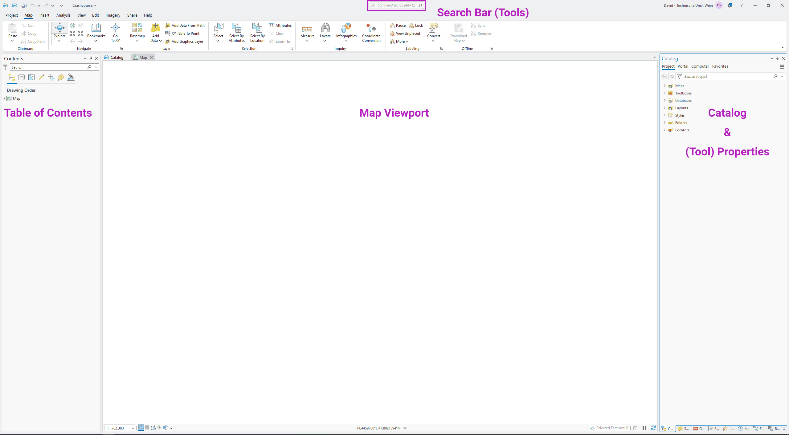
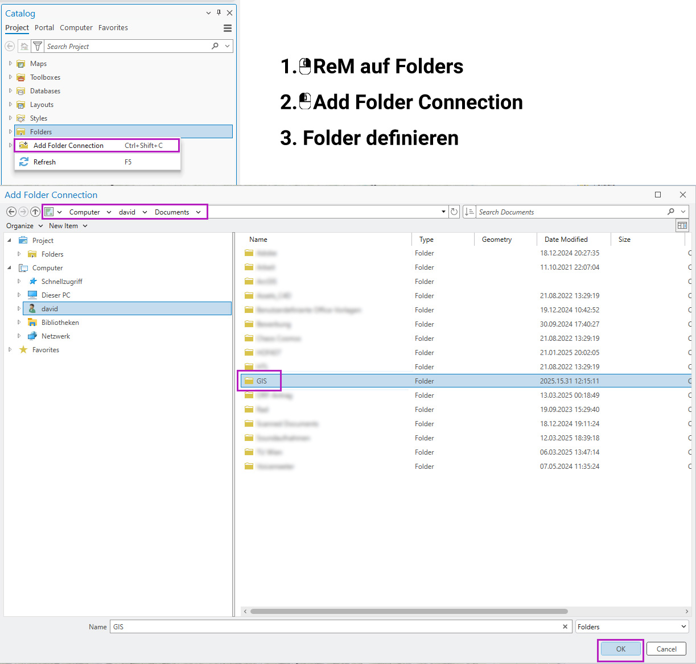
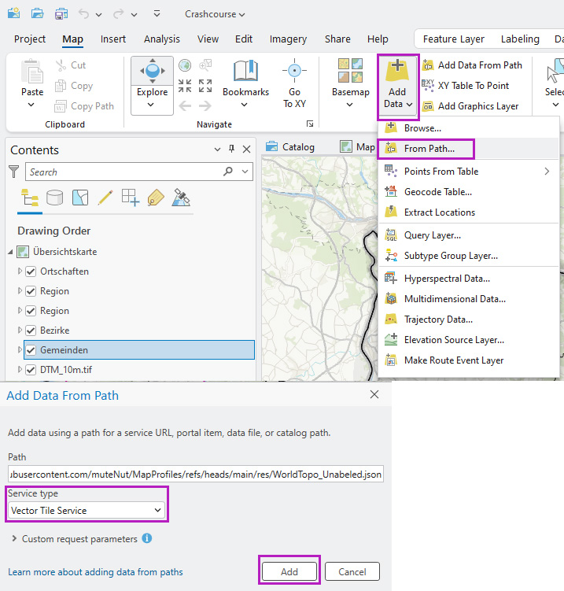

# ArcGIS 101 &ndash; MRA
## unvollständig || work in progress!
Eine rudimentäre Einführung in ArcGIS, um einfache Karten mit Basemap sowie thematische Karten zu erstellen.

## 1. Das Programminterface
Zuerst wird ein neues Projekt erstellt:


Anschließend lädt das Programminterface. Es ist per Default in drei Abschnitte gegliedert: links befindet sich der **Table of Contents**, zentral der **Viewport** und rechts die **Eigenschaften** des jeweils aktiven Tools - im Screenshot ist hier die **Catalog Pane** sichtbar. Im oberen Bereich befindet sich eine Suchleiste, mit der Tools direkt aufgerufen werden können. Für uns relevant sind vor allem Vektoroperationen, die in Abschnitt 3 (kurz) erklärt werden.




## 2. Hinzufügen von Karteninhalten

### 2.1 Vorbereitung

Es empfiehlt sich, externe Daten in einem Verzeichnis zu speichern, das einen kurzen Pfad hat. Wir legen daher einen neuen Ordner an, in dem alle Daten landen, wir später importieren wollen:

```
C:\Users\...\Documents\GIS\
```
Anschließend müssen wir ArcGIS mitteilen, dass dieser neue Ordner im Projekt eingebunden werden soll. Dazu fügen wir eine **Folder Connection** hinzu:



Alle Dateien, die in diesem Ordner gespeichert sind, können direkt vom Catalog mittels Drag&Drop in die Map geschoben werden. Es ist empfehlenswert, zur besseren Übersicht je Datensatz einen Unterordner anzulegen (aber nicht notwendig). Falls die Dateien im Catalog nicht sichbar sind, muss ein **Refresh** durchgeführt werden: Rechtsklick auf **Folders** &ndash; **Refresh**.

### 2.2 Hinzufügen & Symbology

Nachdem ein Layer der Map hinzugefügt wurde, kann die Darstellung angepasst werden. Das geschieht über einen Rechtsklick auf den Layer im **ToC** &ndash; **Symbology**.

### 2.3 Hinzufügen einer Basemap

Eine Basemap soll nicht vom hauptsächlichen Karteninhalt ablenken. Daher bevorzuge ich persönlich eine stumme Karte. In QGIS kann eine solche bspw. mit Plugins konfiguriert werden (z.B. *MapTiler*), in ArcGIS erfolgt die Konfiguration mit dem [Vector Tile Style Editor](https://developers.arcgis.com/vector-tile-style-editor/). Weil die TU Wien es nicht für notwendig hält, die dort erstellten Styles auch speichern zu können, muss die Datei exportiert und auf einem Webserver (in diesem Fall: Github) hochgeladen werden. Sie kann anschließend in ArcGIS importiert werden:



Der Pfad lautet:

``` https://raw.githubusercontent.com/muteNut/MapProfiles/refs/heads/main/res/WorldTopo_Unabeled.json ```

### 2.4 Hinzufügen von Hillshade

Besonders in Gebieten, die von Gebirgen geprägt sind, kann ein Hillshade die Karte aufwerten. Dazu bietet das [BEV](https://www.bev.gv.at/) feinkörnige Geländemodelle zum [Download](https://data.bev.gv.at/geonetwork/srv/ger/catalog.search#/search?isTemplate=n&resourceTemporalDateRange=%7B%22range%22:%7B%22resourceTemporalDateRange%22:%7B%22gte%22:null,%22lte%22:null,%22relation%22:%22intersects%22%7D%7D%7D&sortBy=creationDateForResource&sortOrder=desc&from=1&to=100&any=ALS%20DTM%20H%C3%B6henraster%201m) an. Gleich wie andere Daten wird das Archiv im üblichen Datenverzeichnis entpackt und kann in ArcGIS importiert werden. Die Symbology könnte folgenderweise aussehen und die Basemap überlagern: 

![[Screenshot von Raster Symbology]](./img/raster_sym1.jpg)

![[Screenshot von Raster Symbology]](./img/raster_sym2.jpg)

Für dieses Projekt kann ein vereinfachter Layer [hier](http://fff.fff.fff/DTM_OOe.zip) heruntergeladen werden. **Achtung**: Diese Ressource ist zeitlich begrenzt verfügbar! 

### 2.4 Exkurs: Projektionen

Da die ungefähr kugelförmige Oberfläche der Erde auf eine zweidimensionale Fläche projiziert werden muss, kommt es zu Verzerrungen. Stark vereinfacht ausgedrückt, fallen diese Verzerrungen umso geringer aus, je besser die gewählte Projektion sich mit dem dargestellten Kartenausschnitt überlagert. Für dieses Projekt bietet sich daher eine Projektion an, die zu Österreich passt. Sie wird über einen Doppelklick auf **Map** für die gesamte Karte festgelegt.

| EPSG-Code | Name | Eigenschaft |
| - | - | - |
| 3035 | ETRS89 LAEA | flächentreue Projektion |
| 31255 | MGI / Austria GK Central | winkeltreue Projektion |
| 31287 | MGI / Austria Lambert | winkeltreue Projektion |

Eine vollständige Liste der in Österreich gängigen Projektionen findet sich [hier](https://www.bev.gv.at/dam/jcr:b3d3e774-4a00-4faa-b1c1-eee986e62007/EPSG_Austria_BEV.pdf), mehr Infos zu den Projektionen [hier](https://pro.arcgis.com/de/pro-app/3.3/help/mapping/properties/list-of-supported-map-projections.htm).

Die Kartenlayer, die nicht zur festgelegtne Projektion passen, werden im Hintergrund dynamisch reprojiziert. Es ist von Vorteil, die Layer mit **Project Layer** auf die gewählte Projektion zu transformieren.

### 2.5 Exkurs: Hierarchie
In der Kartengestaltung gibt es viele kreative Darstellungsmöglichkeiten. Dabei sollte die Lesbarkeit jedoch nicht vergessen werden! Daher muss die Darstellungsfolge der einzelnen Layer sinnvoll angepasst werden. Ein Grundsatz ist dabei folgende Reihenfolge:
| Ebene | Geometrie |
| - | - |
| 1 | Punkte |
| 2 | Linien |
| 3 | Flächen |

### 2.6 Exkurs: Farbwahl
Eine gute Farbwahl erleichtert ebenfalls die Lesbarkeit der Karte. Neben den mitgelieferten Presets von ArcGIS können bspw. zur Darstellung von Farbverläufen auch Tools wie der [Colorbrewer](https://colorbrewer2.org/) benutzt werden.
Einige Farben gelten als *Standard* und sollten daher bevorzugt nur für die jeweilige Kategorie gewählt werden:
```
bild von buch einfügen!
```
## 3. Vektoroperationen

Ein kurzer Überblick über die in diesem Kurs wichtigsten Vektoroperationen

### 3.1 Pairwise Clip

### 3.2 Pairwise Intersect

### 3.3 Dissolve

## 4. Attribute Table

### 4.1 Datentypen

### 4.2 Calculate

### 4.3 Filtern (Definition Query)

## 5. Daten verknüpfen (Joins)

## 6. Layout

## 7. Datenverwaltung: Tipps
