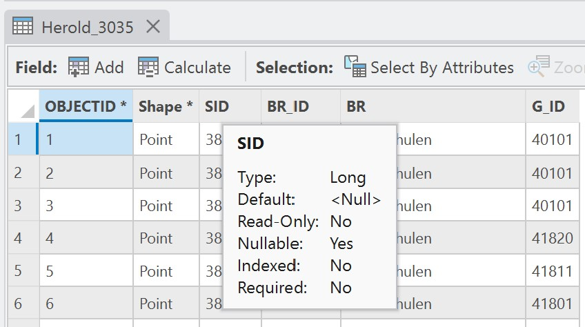
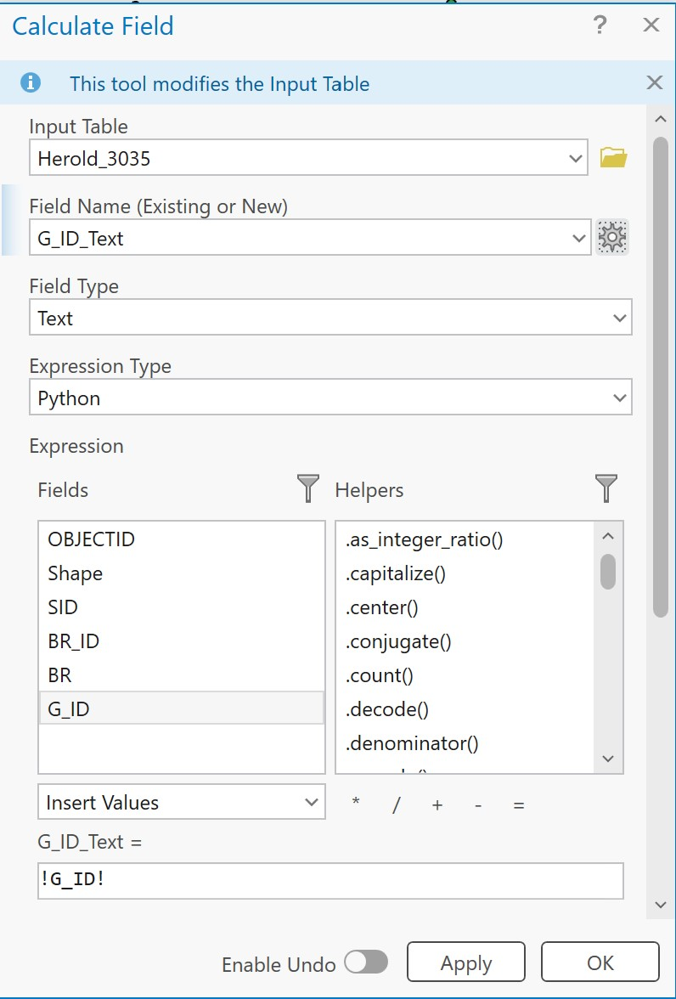
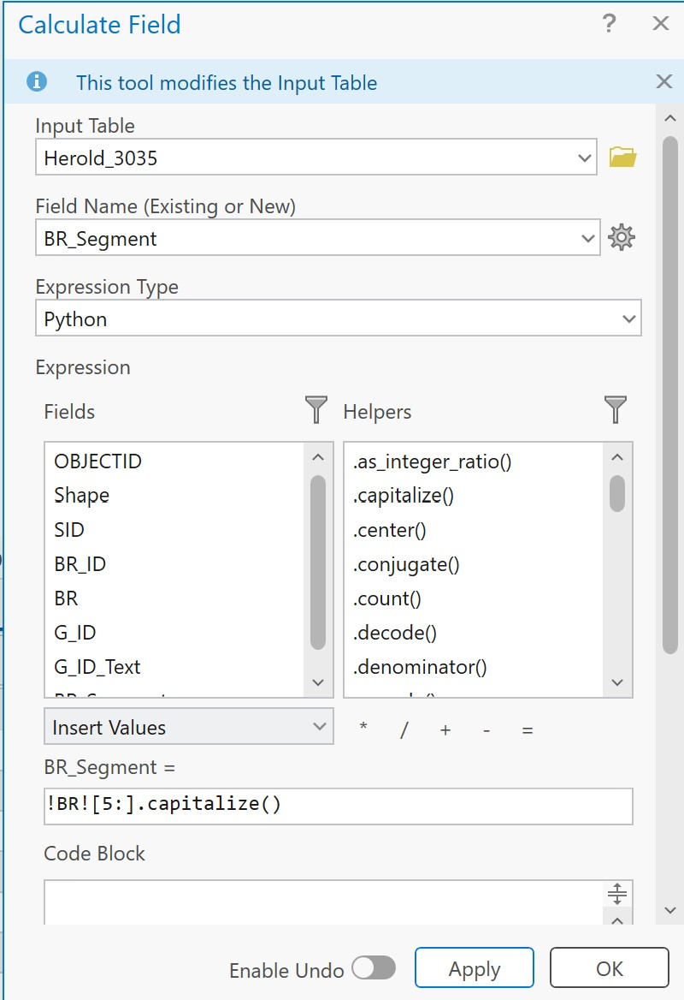
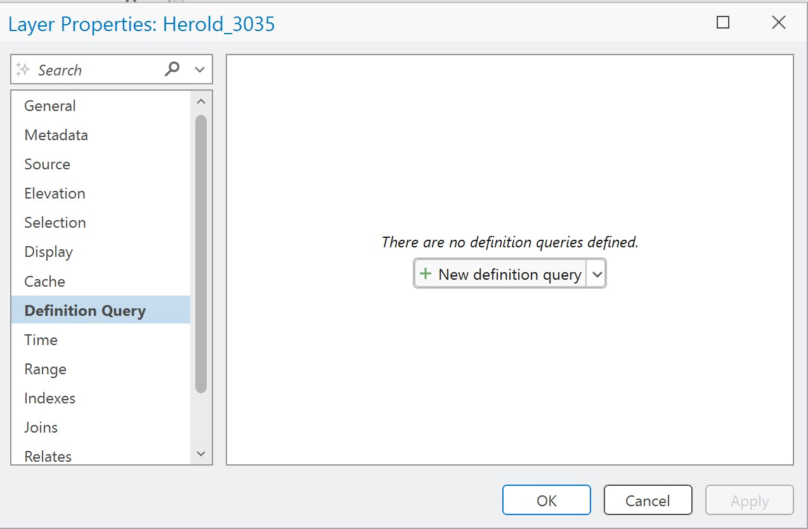
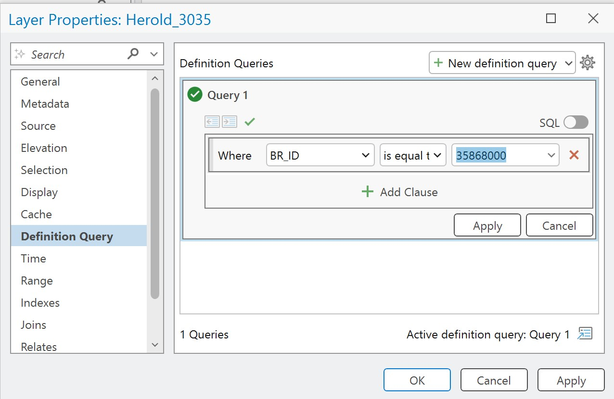
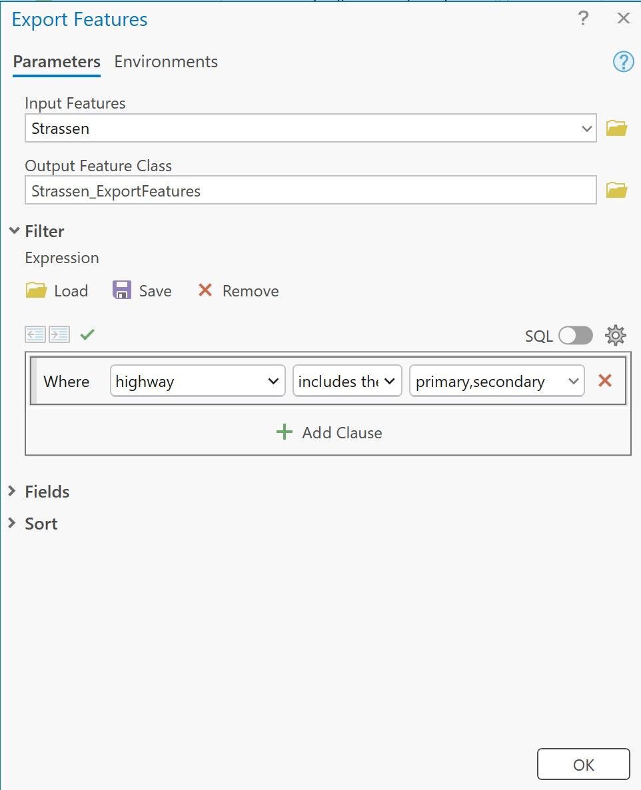

## 4. Attribute Table

Eine wichtige Eigenschaft von Geodaten ist die Verknüpfung von Geometrie und Information. So kann jedes *Feature* in einem Layer unterschiedliche Attribute aufweisen. Die Tabelle kann durch Rechtsklick auf den entsprechenden Layer im `Table of Contents` &ndash; `Attribute Table` aufgerufen werden.

### 4.1 Datentypen

Jede Spalte weist einen Datentyp auf, der aufscheint, wenn man mit der Maus auf einem Spaltentitel bleibt.

Alternativ lässt sich der Datentyp über `Table` &ndash; `Fields` nachprüfen. Dieser Typ ist bspw. wichtig, wenn zwei Tabellen miteinander [verknüpft](./join.md) werden sollen. Die für uns wichtigsten Datentypen sind in der Tabelle angeführt:

| Name | Eigenschaft |
| - | - |
| Text | reguläre alphanumerische Zeichenkette |
| Float | Gleitkommazahl, für die meisten Anwendungsfälle ausreichend |
| Double | Gleitkommazahl |
| Short | Ganzzahl zwischen -32 768 und 32 767 |
| Long | Ganzzahl zw. rund -2 und +2 Millionen |

**Allen numerischen Typen ist gemein, dass sie keine führende 0 unterstützen!**

### 4.2 Calculate

Mit dem Rechner können Attributwerte berechnet und ggf. neue Felder angelegt werden. Die Inhalte der bestehende Felder können so auch überschrieben bzw. aktualisiert werden. Sollte z.B. eine Spalte nicht dem gewünschten Datentyp entsprechen, legt man am einfachsten mit *Calculate* ein neues Feld an und füllt die Werte der bisherigen Spalte dort ein:

Der Calculator versteht auch Python. So kann zB Teil einer `Text`-Spalte extrahiert werden:

Zudem können Funktionen definiert werden. Für diesen Kurs ist das aber irrelevant.

### 4.3 Filtern (Definition Query)

Die Features in einem Layer können anhand verschiedener Kriterien gefiltert werden. Das geschieht mit einer *Definition Query*, die über einen Doppelklick auf den entsprechenden Layer im `Table of Contents` auffindbar ist:

Mit Klick auf `New definition query` kann ein neuer Filter erstellt werden:

Ein ähnliches Ergebnis kann erzielt werden, wenn die Features eines Layers exportiert werden (`Rechtsklick auf Layer` &ndash; `Export Features`). Hier können Parameter gewählt werden, welche Features in einen neuen Layer exportiert werden sollen:

[Zurück](./vector.md)

**Weiter mit: [Daten verknüpfen (Joins)](join.md)**
