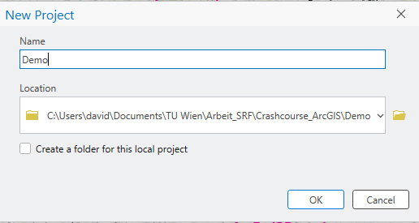

## 1. Das Programminterface
Zuerst wird ein neues Projekt erstellt:

Anschließend lädt das Programminterface. Es ist per Default in drei Abschnitte gegliedert: links befindet sich der **Table of Contents**, zentral der **Viewport** und rechts die **Eigenschaften** des jeweils aktiven Tools - im Screenshot ist hier die **Catalog Pane** sichtbar. Im oberen Bereich befindet sich eine Suchleiste, mit der Tools direkt aufgerufen werden können. Für uns relevant sind vor allem Vektoroperationen, die in Abschnitt 3 (kurz) erklärt werden.

[Zurück](./README.md)

[Nächster Abschnitt](./add_content.md)
