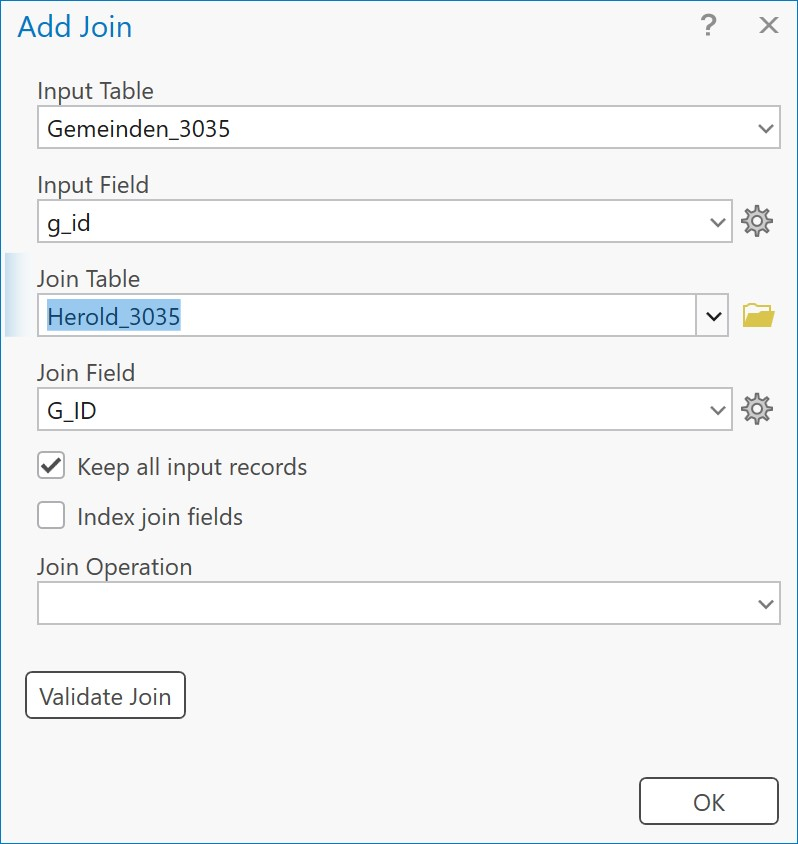

## 5. Daten verknüpfen (Joins)

Die Attribute unterschiedlicher Layer bzw. Tabellen können miteinander verknüpft werden, sodass Informationen von einer Tabelle an eine andere Tabelle angehängt werden. Dafür gibt es unterschiedliche Methoden.

### 5.1 Add Join

*Add Join* erstellt eine dynamische Verknüpfung, die zugrundeliegende Attributtabelle wird dabei nicht geändert. Ein so erstellter Join kann daher auch einfach wieder entfernt werden. Aber **Achtung**: wird bspw. die Quell-Tabelle gelöscht, so funktioniert der Join nicht mehr! Die neu ergänzten Felder werden erst persistent, wenn die Features exportiert werden, was zB mit Rechtsklick auf den Layer &ndash; **Data** &ndash; **Export Features** geschehen kann.

Um einen solchen Join zu erstellen, wird das Dialogfenster durch Rechtsklick auf den Layer &ndash; **Joins and Relates** &ndash; **Add Join** geöffnet.

**Wichtig** ist hierbei, dass der **Datentyp** von *Input* und *Output* Field übereinstimmt! Der Join kann mit *Validate Join* überprüft und anschließend durchgeführt werden.

### 5.2 Join Field

*Join Field* lässt sich über die Suchleiste aufrufen und verändert die Attributtabelle unmittelbar. Vorteil dieser Methode ist, dass die *Transfer Fields* ausgewählt werden können. Das heißt, dass nur die gewählten Spalten an die Attributtabelle angehängt werden. Die Funktionsweise deckt sich mit [Add Join](#51-add-join)

### 5.3 Spatial Join

### 5.4 Daten filtern (Definition Query)

[Zurück](./attr.md)

**Weiter mit: [Layout](./layout.md)**
