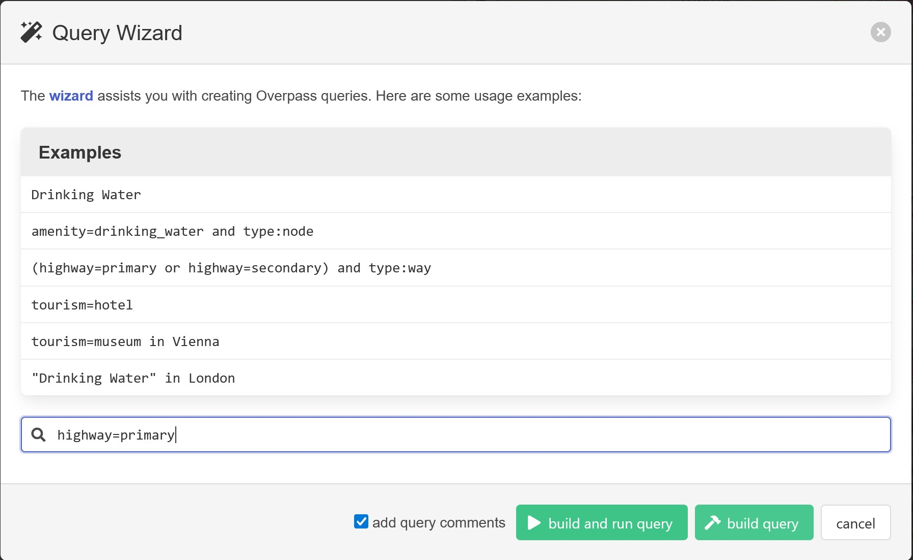

## 7. Datenverwaltung: Tipps

### 7.1 Verwaltung im Catalog View

#### Kopieren von Karten

Im Catalog View können sämtliche Inhalte eines Projekts verwaltet werden. Eine besonders nützliche Funktionalität ist das Duplizieren von Karten. So kann zuerst eine Basiskarte erstellt werden. Diese wird anschließend dupliziert, sodass für jede zu erstellende thematische Karte eine Map existiert. Jede Map kann unterschiedliche Layer enthalten, sodass eine Orientierung im Projekt leicht fällt und auch nachträglich gezielt Karten verändert oder angepasst werden können.

#### Kopieren von Layouts

Dasselbe gilt für Layouts. Besonders praktisch ist hierbei, dass die Maps im Layout dynamisch verknüpft sind und daher austauschbar sind. Möglicherweise geht beim Tausch der Extent verloren, aber die Werte können mittels *Copy&Paste* von einem bestehenden Layout übernommen werden. Einzig die Legende muss für jede Karte erneut angepasst werden. Der Export funktioniert dafür sehr schnell, darüberhinaus weisen dadurch alle Karten die gleichen Dimensionen und den gleichen Maßstab auf &ndash; so ergibt sich ein einheitliches Bild.

### 7.2 Datenquellen

Es gibt eine Vielzahl von nützlichen Datenquellen, die für diese und weiter Lehrveranstaltungen nützlich sind. Dazu zählen:

  

    <b>1. data.gv.at</b>
  

  Die OpenData Plattform bietet eine Fülle an unterschiedlichem Datenmaterial. Es empfiehlt sich, die Dateien entweder als *.shp oder *.geojson (mit anschließendem Import in ArcGIS mit dem Tool <b>JSON to Features</b>).

  

    <b>2. Openstreetmap</b>
  

  Diese gemeinschaftlich erstellten Geodaten sind in vielerlei Hinsicht nützlich. Um sie gezielt herunterzuladen, kann man sich <a href="https://wiki.openstreetmap.org/wiki/Map_features">hier</a> einen Überblick über die Attribute der Daten verschaffen. Der Zugriff erfolgt anschließend über ein Tool wie zB <a href="https://overpass-turbo.eu/">Overpass Turbo</a>.

  Dort werden entsprechende Queries erstellt, beispielsweise wie im Screenshot alle Straßen mit dem **Key:** *"primary"*. 

  

  Anschließend wird der Query durch Klick auf *build and run query* ausgeführt. Das Ergebnis kann über *Export* &ndash; *GeoJSON* heruntergeladen und in ArcGIS importiert werden (erneut: **JSON to Features**)

  

    <b>3. Natural Earth Data</b>
  

  <a href="https://www.naturalearthdata.com/">Natural Earth Data</a> ist eine zuverlässige Datenquelle für bspw. Grenzen und (große) Städte.

Einige relevante Datenquellen sind [hier](./res/info.md) aufgelistet bzw. wird hier ein aufbereitetes [Straßennetz](./res/strassen.geojson) von Openstreetmap zur Verfügung gestellt.

[Zurück](./layout.md)

**Weiter mit: [Datenaustausch mit Tabellenkalkulationsprogrammen](./xls.md)**
