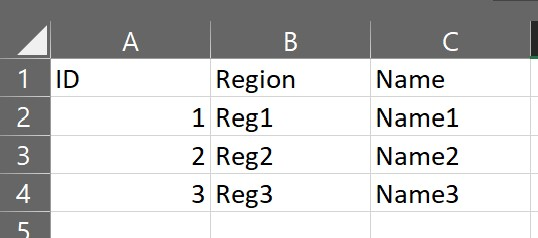

## 8. Datenaustausch mit Tabellenkalkulationsprogrammen

### 8.1 Importieren von Tabellen
Möchte man ein Tabellenblatt bspw. von Excel in ArcGIS importieren, dann empfehlen wir als Austauschformat im allgemeinen `CSV` (*comma separated values*). Dieses Format ist sehr einfach aufgebaut und enthält in der ersten Zeile die Spaltentitel, die durch Kommas getrennt sind. Sollte Excel Kommas als Trennzeichen für rationale Zahlen nutzen, wird als Trennzeichen häufig ein Semikolon `;` genutzt. In jeder nachfolgenden Zeile folgen die Attribute für jede Spalte, erneut durch Kommas bzw. Semikolons getrennt.

Während *QGIS* hier eine Vielzahl an Importieroptionen bietet, gibt es in ArcGIS nichts dergleichen. Daher kann es ua Encodingprobleme geben.

**Daher gelten folgende Grundsätze:**

  

    1. Kommas sollen Punkte sein.
  

  Damit ArcGIS Zahlen als numerische Daten und nicht als Text interpretiert, sollten im Idealfall alle Kommas durch Punkte ersetzt werden. Das geht mit einem Tool wie <a href="https://notepad-plus-plus.org/">Notepad++</a> sehr einfach. Alternativ kann man die Felder einzeln in ArcGIS mit dem richtigen Datentyp neu anlegen und die Werte übertragen.

  

    2. Encoding sollte UTF8 sein.
  

  ArcGIS hat häufig Probleme mit Umlauten. Daher sollte in Excel das CSV als Dateityp UTF8 aufweisen:

  

  

    3. Tabelleninhalt muss bei Bedarf angepasst werden.
  

  In der ersten Zeile <b>muss</b> der Spaltenname stehen, ab der zweiten Zeile folgen die Werte. Es darf keine leeren Spalten geben! Ein gültiges CSV sieht dementsprechend zB so aus:
  

  

Anschließend kann die Datei in das in [Kapitel 2.1](add_content.md/#21-vorbereitung) erstellte Verzeichnis gespeichert bzw. verschoben und in ArcGIS geladen werden.

### 8.2 Exportieren von Tabellen
Sollen Tabellen von ArcGIS in anderen Programmen wie zB Excel oder SPSS importiert werden, kann man sie aus ArcGIS über Rechtsklick auf den jeweiligen Layer im `Table of Contents` &ndash; `Data` &ndash; `Export Table` exportiert werden. Hier sollte der Pfad für `Output Table` **inkl. Dateiendung** festgelegt werden. Zudem können die Daten gefiltert werden (siehe [Filtern](attr.md/#43-filtern-definition-query) sowie die Fields bearbeitet werden (Umbenennen, Entfernen).

Der Import in den anderen Programmen erfolgt wie üblich. In Excel können die Werte anschließend zB über `Daten` &ndash; `Text in Spalten` übernommen werden.

[Zurück](./tips.md)
